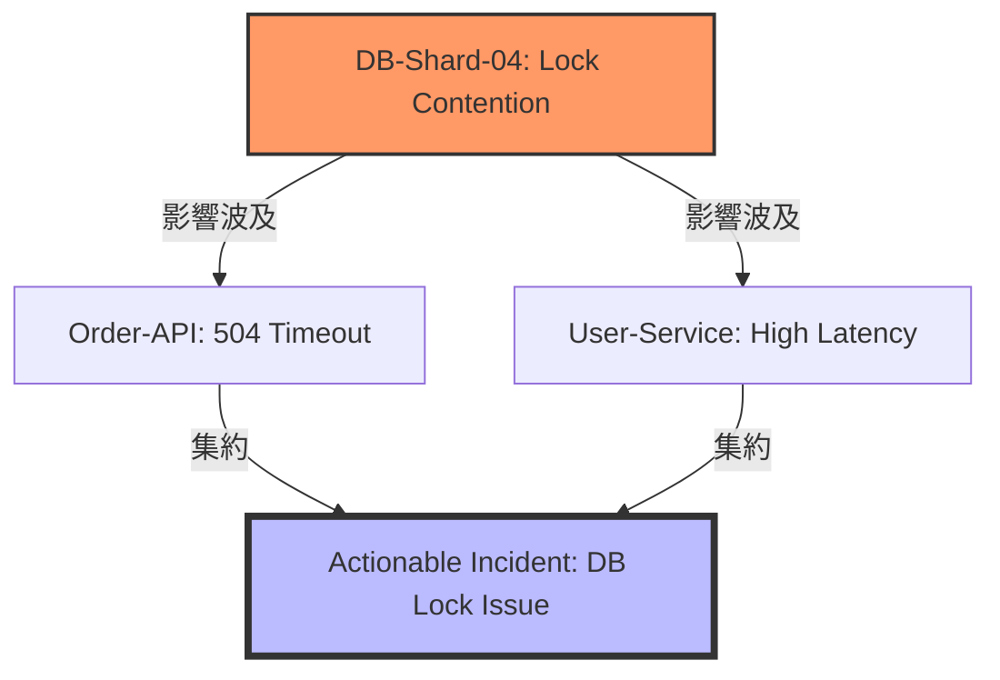

現代の分散システムにおいて、障害発生時に数千件のアラートが押し寄せる情報の洪水は判断を狂わせ、復旧を遅らせるだけでなく、エンジニアの精神を摩耗させます。

本記事では、著書『AIOps実践ガイド』に基づき、膨大なRaw Alertを「意味のある数件のインシデント」に凝縮するための相関分析（Correlation）の技術的アプローチを解説します。

### 1. ノイズ削減率90%を実現する「集約の4ステップ」

単にアラートを減らすのではなく、重要な情報を落とさずに密度を上げることがAIOpsの真髄です。以下の4段階のプロセスを経て、Raw AlertsはActionableなインシデントへと昇華されます。

1.  **Deduplication（重複排除）**:

    全く同一のソースから発生した同一内容のアラートを1つにまとめます。これは最も基本的なステップですが、これだけで全体の3〜4割のノイズが消えることも珍しくありません。
2.  **Time-based Correlation（時間窓による集約）**:

    「同じ時間枠（スライディングウィンドウ）」内で発生した関連性の高いイベントをグループ化します。
3.  **Topology-based Correlation（トポロジーによる相関）**:

    システムの依存関係（トポロジー）に基づき、「上流のDBが落ちたことで、下流のAPI群がエラーを吐いている」といった親子関係を特定し、根本原因を軸に集約します。

4.  **Pattern Matching（類似度によるクラスタリング）**:

    NLP（自然言語処理）やクラスタリング手法を用い、テキストの類似度から「過去の類似障害」と紐づけ、既知の解決策を提示します。

### 2. 相関分析の2大アプローチ：Time vs Topology

相関分析の精度を決定づけるのは、「時間」と「構造」の2つの軸です。

#### A. 時間軸による集約 (Temporal Correlation)

特定の期間（例：5分間）に発生したアラートを「1つの事象」とみなす手法です。

* **メリット**: 実装が容易で、特定のコンポーネントが連続してエラーを出すケースに極めて有効。
* **難所**: 「たまたま同じ時間に起きた無関係な2つの障害」を誤って1つにまとめてしまうリスクがある。

#### B. トポロジー軸による集約 (Structural Correlation)

サービス間の依存マップ（トポロジー）を参照し、影響の波及経路をたどる手法です。

* **ロジック**: 「DB-Shard-04」でレイテンシが増大し、それに依存する「Payment-Service」で5xxエラーが急増した場合、これらを個別の障害ではなく、DBを根本原因とする1つのストーリーとして結合します。
* **メリット**: 真の根本原因（Root Cause）を特定しやすく、MTTR（平均復旧時間）を劇的に短縮できる。

### 3. Analytics Layerの実装アーキテクチャ

これらの分析は、AIOpsプラットフォームのAnalytics Layerにおいて実行されます。

【ここに画像挿入：ストリーム処理（Kafka/Flink）を用いたリアルタイム分析レイヤーの構成図】

* **Stream Processing (Kafka/Flink)**: 流入するアラートイベントをリアルタイムに処理し、定義された時間窓で集約ロジックを走らせます。
* **Inference Engine**: 学習済みのトポロジーマップやパターン認識モデルを適用し、インシデントの重要度を判定します。

### 結論：アラートは確認するものから解決するものへ

相関分析のゴールは、アラートの数を減らすこと自体ではありません。エンジニアが次に何をすべきか（Next Action）を明確にすることにあります。
ノイズを極限まで削ぎ落とし、システムの根本原因に気づける環境を構築することが大事ですね。

本記事では触れきれなかった、具体的なトポロジーマップの構築手法や、異常検知に用いる機械学習モデル（Isolation Forest等）の詳細は、著書『AIOps実践ガイド：自律型IT運用への進化論』で詳しく解説しています。

