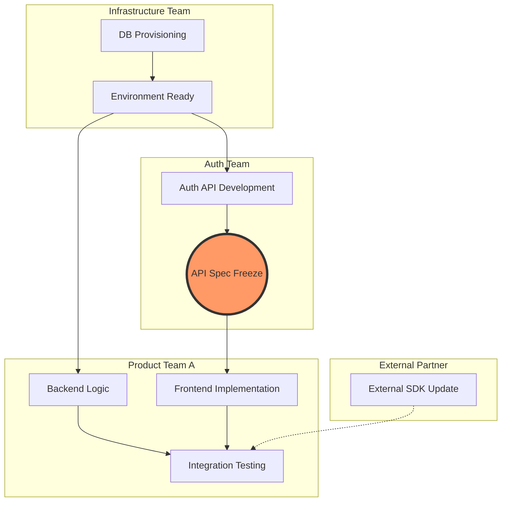

大規模なプロジェクトにおいて、最も多い失敗の原因は「技術的なスキルの不足」ではなく、「チーム間の依存関係の見落とし」です。

* 「APIの仕様が確定しないと、フロントエンドの実装が止まる」
* 「基盤チームのリリースが1週間遅れた影響で、後続の3チームが動けなくなった」

こうした事態を防ぐために、TPM（テクニカルプログラムマネージャー）が活用するのが「依存関係マップ」です。単なるスケジュールの羅列であるガントチャートとは異なり、プロジェクトの「構造的リスク」を可視化するこの手法について、具体的な書き方を解説します。

---

## 1. なぜガントチャートだけでは不十分なのか

ガントチャートは「いつ、誰が、何をやるか」を管理するのには向いていますが、「Aが終わらないとBが始められない」といった因果関係の連鎖が見えにくいという弱点があります。

特に3つ以上のチームが絡む場合、依存関係は網目状になり、一箇所の遅延がどこに波及するかを直感的に把握できなくなります。これを「ノード（タスク）」と「エッジ（繋がり）」で整理するのが依存関係マップの役割です。

---

## 2. 依存関係マップ作成の3ステップ

### STEP 1：ノード（要素）の洗い出し
まずは、プロジェクトに関わる全チームと、それぞれの主要なマイルストーンを書き出します。
* 例：認証チーム（Auth API公開）、注文チーム（注文フロー実装）、インフラチーム（DBプロビジョニング）

### STEP 2：依存の種類を分類する
すべての繋がりを同じ重さで扱わず、以下の2種類に分類します。
* **ハード依存：** 「それがないと物理的に着手できない」もの（例：APIドキュメントがないとクライアント実装ができない）。
* **ソフト依存：** 「あった方が良いが、モックなどで回避可能」なもの。

### STEP 3：Mermaidを用いた可視化
Zennでも利用できるMermaid記法を使うと、コードベースで図を管理でき、更新も容易になります。



````
graph TD
    subgraph "Infrastructure Team"
        A[DB Provisioning] --> B[Environment Ready]
    end

    subgraph "Auth Team"
        B --> C[Auth API Development]
        C --> D((API Spec Freeze))
    end

    subgraph "Product Team A"
        D --> E[Frontend Implementation]
        B --> F[Backend Logic]
        F --> G[Integration Testing]
        E --> G
    end

    subgraph "External Partner"
        H[External SDK Update] -.-> G
    end

    style D fill:#f96,stroke:#333,stroke-width:4px
````

## 3. マップから「クリティカルパス」を特定する
マップが完成したら、以下の視点で分析を行います。

1. ハブ（集中点）の特定： 多くの矢印が集まっているノード（例：上記のAPI Spec Freeze）は、プロジェクト全体のボトルネックです。TPMはここにリソースを集中させ、遅延を徹底的に防ぎます。

2. デッドロックの回避： AはBを待ち、BはAを待つといった循環参照がないか確認します。

3. 「外部」という不確実性： 外部パートナーや他部署のタスク（点線部分）は、自チームでコントロールできない最大のリスクです。ここにバッファを持たせます。

4. 運用：マップは「生き物」である
一度作って終わりのマップは無意味です。週に一度のシンクアップ会議でマップを投影し、「矢印の向きや重みが変わっていないか」をチーム間で確認します。

「ここが遅れると、あちらのチームが2週間止まります」という事実を、感情論ではなく図（ロジック）で示すことで、権限のないTPMであっても組織全体に強い影響力を行使できるようになります。

## 結論：可視化がチームを救う

依存関係マップを書くことは、プロジェクトの「未来の炎上」を今、予見することに他なりません。 「誰のボールか分からない」という隙間を埋め、スムーズなデリバリーを実現するために、ぜひMermaidを活用してマップを自社プロジェクトに導入してみてください。

## 大規模プロジェクトのリーダー・マネージャーの皆様へ

私の著書『テクニカルプログラムマネージャー（TPM）実践ガイド』では、本記事で紹介した依存関係マップのさらに詳細な運用方法や、複雑なマルチチーム間での「コンフリクト（対立）」を解消するための具体的な交渉術を体系化しています。

現場の混沌を整理し、プロジェクトを確実に成功へ導きたい方は、ぜひ本編をチェックしてみてください。
[](https://amzn.asia/d/ddhsrjZ)
