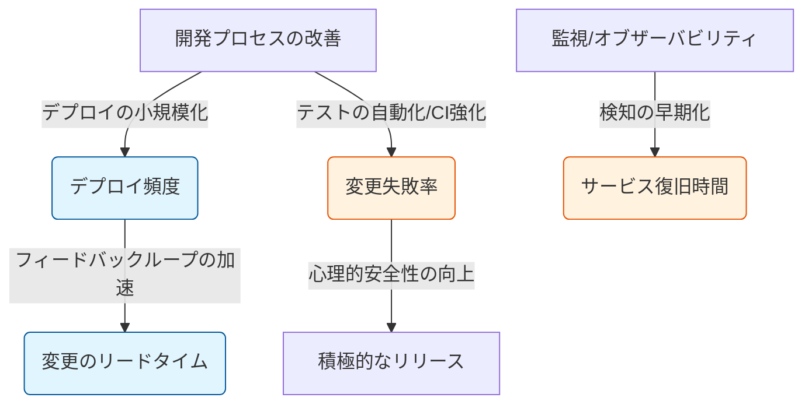

「エンジニアリング組織の生産性は、どう測ればいいのか？」

この問いに対して、「コードの行数」や「プルリクエストの数」といった個人のアウトプットを追ってしまうと、組織は容易にハックされ、本質的な価値から遠ざかってしまいます。

著書『EMからVPoE/CTOへの道』および『Tech Team Management』では、生産性を「管理」するためのものではなく、「ボトルネックを特定し、投資を正当化するための共通言語」として定義しています。本記事では、デファクトスタンダードである「Four Keys」を中心に、実務的なメトリクス設計を解説します。

## 1. なぜ「個人の活動」を測ってはいけないのか

個人のコミット数やPR数を評価に直結させると、エンジニアは「PRを細切れにする」「意味のない修正を増やす」といった行動をとるようになります。これはグッドハートの法則（指標が目標になると、それは良い指標ではなくなる）の典型例です。

DBREやVPoEの視点では、個人の動きではなく、「システム全体が価値を届けるリードタイムと安定性」を測定すべきです。

## 2. Four Keys：組織の健康状態を測る4つの指標

DORA（DevOps Research and Assessment）が定義した「Four Keys」は、開発の「速さ」と「安定性」を同時に測定できる優れたフレームワークです。

| 指標 | 意味 | 測定するもの |
| :--- | :--- | :--- |
| **デプロイ頻度** | 速さ | 組織がどれだけ頻繁に価値をデプロイしているか |
| **変更のリードタイム** | 速さ | コードが書かれてから本番環境で動くまでの時間 |
| **変更失敗率** | 安定性 | デプロイの結果、どれだけ障害や切り戻しが発生したか |
| **サービス復旧時間** | 安定性 | インシデント発生からサービスが復旧するまでの時間 |

## 3. メトリクスの因数分解

これらの指標は独立しているのではなく、図のように相互に作用します。

## 4. 経営層との「共通言語」にする技術

Four Keysをそのまま経営会議に出しても、「デプロイ頻度が上がりました」だけでは響きません。以下のように「ビジネス価値」へ翻訳する必要があります。

* **デプロイ頻度 → 「市場への適合速度」：** 顧客の要望にどれだけ早く応えられるか。
* **変更失敗率 → 「機会損失のリスク」：** システムの不安定さがどれだけ売上の阻害要因になっているか。

これらを可視化することで、「技術負債を返済するために開発を止める」という提案が、「将来のリードタイムを短縮し、市場競争力を維持するための投資」というロジカルな経営判断へと昇華されます。

## 結論：メトリクスは「コンパス」であり「槍」ではない

生産性の可視化は、誰かを問い詰めるための「槍」ではなく、チームが正しい方向に進んでいるかを確認するための「コンパス」です。

Four Keysを導入し、事実（データ）に基づいて対話する文化を作る。それこそが、エンジニアリング組織を一段上のステージへ引き上げるための、VPoE/CTOとしての戦略的な第一歩となります。

---

## 大規模プロジェクトのリーダー・マネージャーの皆様へ

組織全体のパフォーマンスを最大化し、経営と技術の架け橋となる。
私の著書『EMからVPoE/CTOへの道』では、本記事で紹介したメトリクス設計のさらなる詳細や、それを用いた組織評価・育成の仕組み作りを解説しています。

また、現場レベルでのチームマネジメントについては『Tech Team Management』にそのエッセンスを凝縮しています。データで語り、信頼を勝ち取るための具体的なメソッドを本書で手に入れてください。

