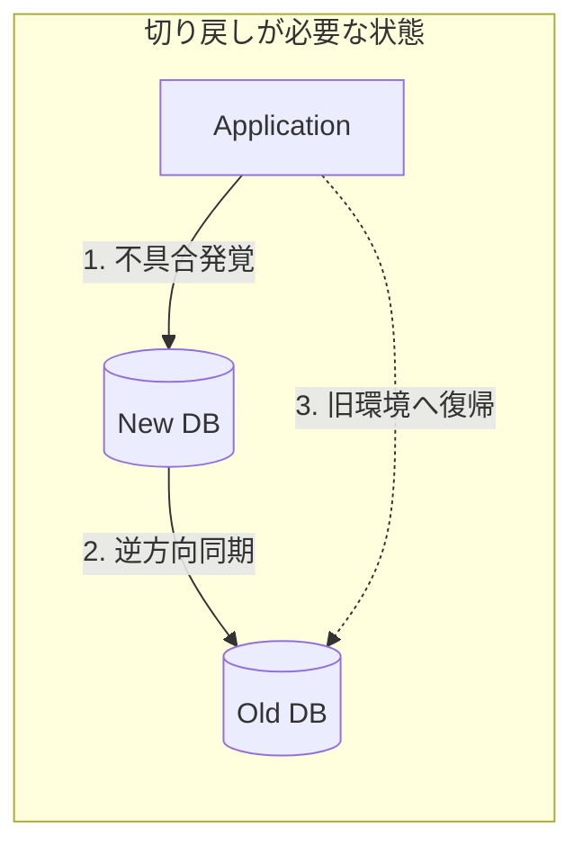

DB移行の当日、最も緊張が走る瞬間は「切り替え（Cutover）」です。
万全の準備をしても、本番トラフィックが流れて初めて発覚する不具合は存在します。そのとき、冷静に「撤退」を決断できるかどうかは、事前の切り戻し設計（Rollback Design）の解像度に依存します。

著書『実践DBRE Vol.1』では、移行の成功と同じくらい「安全な失敗」を重視しています。本記事では、事態の深刻度に応じた3つの切り戻しシナリオを解説します。

## 1. シナリオA：即時切り戻し（Instant Revert）
**【状況】** 切り替え直後、エラーレートの急増、あるいは接続不能が発覚した場合。

このフェーズでは、まだ新環境に重要なデータが書き込まれていない（あるいは、書き込まれたデータは破棄して旧環境でリトライ可能）と判断します。

* **アクション：** DNS、Proxy、またはロードバランサーの向きを旧環境へ即座に戻す。
* **ポイント：** 旧環境のデータベースを「参照専用（Read-only）」にせず、すぐに書き込みを受け入れられる状態で待機させておく必要があります。

## 2. シナリオB：データ同期を伴う切り戻し（Delayed Revert）
**【状況】** 切り替えから数十分〜数時間後、特定の機能でデータ不整合やサイレントな不具合が見つかった場合。

この場合、新環境には既に「新しく書き込まれたデータ」が存在します。単純に旧環境へ戻すと、移行期間中のデータが消失してしまいます。

* **戦略：逆方向レプリケーション（Reverse Sync）**
  移行中、新環境（新DB）から旧環境（旧DB）へ向けて、リアルタイムでデータを同期し続ける「逆向きのパイプライン」を構築しておきます。
* **アクション：**
  1. 逆方向の同期が完了していることを確認。
  2. アプリケーションの接続先を旧環境へ戻す。
  3. データの欠損なしに撤退完了。

## 3. シナリオC：前向きな復旧（Fix-Forward）
【状況】 切り戻しにかかるリスクやダウンタイムが、不具合を修正するリスクを上回る場合。

いわゆる「Point of No Return（帰還不能点）」を超えた後の判断です。大量のデータが新環境で更新され、旧環境との差分が大きくなりすぎた場合に採用します。
* アクション： 旧環境へは戻さず、新環境のままパッチ適用や設定変更で問題を解決する。
* 判断基準： 「戻す手順の複雑性」が「修正の困難さ」を超えたとき。この判断を下すためには、移行当日のタイムリミット（Check Point）を事前に合意しておくことが不可欠です。

## 結論：切り戻しプランは「保険」ではなく「自信」
「戻し方」が完璧に設計・リハーサルされているプロジェクトでは、メンバーは過度な恐怖心を持たずに移行に臨めます。
DBREにとって、切り戻し設計は「負け」の準備ではありません。どんな事態になってもデータを守り抜くという、エンジニアリングにおける最高の誠実さの現れなのです。

## 大規模プロジェクトのリーダー・マネージャーの皆様へ
失敗できない移行をコントロール可能なイベントに変えるためのノウハウが詰まっています。ぜひ本編を手に取ってみてください。

