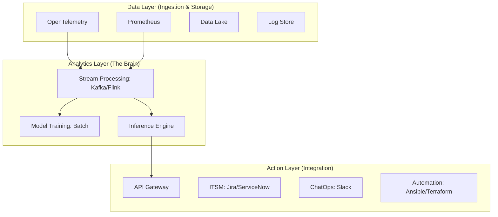

自律型IT運用を実現するためには、単にAIモデルを導入するだけでは不十分です。膨大なデータをリアルタイムに処理し、インテリジェンスを具体的な「行動」へと変換する堅牢なプラットフォームアーキテクチャが不可欠となります。

本記事では、著書『AIOps実践ガイド』で提唱している3層のプラットフォーム設計について、その技術的コンポーネントと役割を詳述します。

### 1. 3層のアーキテクチャ・スタック

AIOpsプラットフォームは、大きく分けて「データ」「分析」「アクション」の3つのレイヤーで構成されます。

### 2. Data Layer：スケーラブルなストレージと標準化

全ての起点となるレイヤーです。ここではデータの収集と正規化（Standardization）が主な責務となります。

* **Ingestion (OpenTelemetry):** メトリクス、ログ、トレースをベンダーニュートラルな形式で収集します。
* **Storage (Prometheus / Data Lake / Log Store):** 時系列データや非構造化ログを、分析に適した形で保存します。
* **要件:** 高ボリュームなデータに対応するため、水平スケーリング（Horizontal Scaling）が可能な設計が求められます。

### 3. Analytics Layer：インテリジェンスを司る脳

収集されたデータから意味を抽出し、推論を行う層です。

* **Stream Processing (Kafka/Flink):** 到着するデータをリアルタイムで解析し、異常の予兆を検知します。
* **Model Training (Batch):** 過去の履歴データを用いて、定期的に機械学習モデルを更新・再学習させます。
* **Inference Engine:** 学習済みモデルに基づき、現在の状況が「異常」か、あるいは「将来どうなるか」を推論します。

### 4. Action Layer：価値をデリバリーするインターフェース

分析結果を実際の運用フロー（Workflow）へ統合するレイヤーです。

* **ITSM & ChatOps:** JiraやServiceNowへのチケット自動起票、Slackを通じたエンジニアへの通知を行います。
* **Automation (Ansible / Terraform):** 承認済みの実行プランに基づき、インフラの自己修復（Self-healing）や構成変更を自動実行します。
* **API Gateway:** 外部システムとの連携窓口となり、レスポンスの統合管理を行います。

### 5. 非機能要件：信頼性を支える3つの柱

プラットフォームとして機能するためには、以下の要件を満たす必要があります。

1. **リアルタイム性:** イベント駆動型アーキテクチャ（Event-driven architecture）を採用し、遅延を最小限に抑える必要があります。
2. **スケーラビリティ:** データの爆発的な増加に対応できる柔軟性。
3. **セキュリティ:** 厳格な権限管理（RBAC）と詳細な監査ログ（Audit Logs）の保持が不可欠です。

### 結論：データから行動までの距離を縮める

AIOpsプラットフォームの真価は、データの収集（Observe）から推論（Engage）、そして行動（Act）までのサイクルをいかにスムーズに、かつ安全に回せるかにかかっています。この3層構造を意識した設計を行うことで、単なるAIの導入を超えた、真に自律的な運用基盤を構築することが可能になります。

自律型運用のためのプラットフォームをどう構築し、維持していくかについて、私の著書『AIOps実践ガイド：自律型IT運用への進化論』では、本記事で解説したアーキテクチャのより詳細な設計指針や、MLOpsパイプラインの具体的な回し方、そしてデータ品質の壁を乗り越えるための実践的なアプローチを体系化しています。

壊れないシステムから、自ら直るシステムへ。次世代の運用基盤を作るためのヒントを、ぜひ本書で掴んでください。
