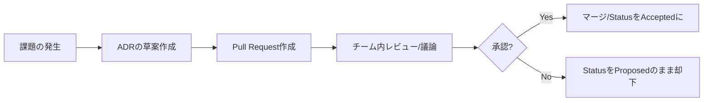

新しい技術の選定やアーキテクチャの変更。その瞬間は最適だと思って下した決断も、半年後や1年後には「なぜこれを選んだんだっけ？」と疑問に変わることがあります。

* 「当時の制約は何だったのか？」
* 「他に検討した選択肢（代替案）は何だったのか？」
* 「なぜその代替案は不採用になったのか？」

これらの文脈（コンテキスト）が失われると、後に残るのは「理解不能なレガシーシステム」だけです。

著書『EMからVPoE/CTOへの道』では、組織の技術的負債を防ぎ、意思決定の納得感を最大化する手法として、ADR（Architecture Decision Records）の導入を推奨しています。本記事では、その具体的な運用方法について解説します。

## 1. ADR（アーキテクチャ意思決定記録）とは何か

ADRは、技術的な重要な意思決定を、その「背景」や「プロセス」とともに短いテキストファイルとして記録し、Gitリポジトリなどで管理する手法です。

単なる「仕様書」とは異なり、「なぜその結論に至ったのか」という意思決定の軌跡を資産として残すことに主眼を置いています。

## 2. ADRに含めるべき5つの要素

ADRは、エンジニアが日常的に書けるよう、シンプルであるべきです。私は以下の5つのセクションで構成することを推奨しています。

1.  **タイトル（Title）：** どのような決定をしたか（例：MySQLからPostgreSQLへの移行）
2.  **ステータス（Status）：** 提案中、承認済み、廃止、置き換えなど
3.  **コンテキスト（Context）：** 解決したい課題、当時のビジネス制約、技術的背景
4.  **決定（Decision）：** 選んだ解決策の説明
5.  **結果（Consequences）：** その決定によって得られるメリットと、あえて許容したデメリット（負債）

## 3. ADRを導入する3つのメリット

### ① 意思決定の「納得感」と「透明性」
VPoEやCTO、テックリードが独断で決めたように見えることも、ADRとして検討プロセスが公開されていれば、チーム全体の納得感が得やすくなります。「反対だが、合意する（Agree to Disagree）」ための論理的根拠となります。

### ② オンボーディングの加速
新しく加わったメンバーが、既存のシステム構成を見て「なぜこうなっているの？」と感じたとき、ADRを読めば当時の意図を即座に理解できます。過去の経緯を説明するシニアエンジニアの手間を大幅に削減します。

### ③ 責任ある「負債」の引き受け
「あえて今はスピードを優先し、技術的負債を許容する」という決断も、ADRに残しておけば、それは「見落とし」ではなく「戦略的な選択」になります。

## 4. ADRの運用フロー

ADRはGitHubなどのPull Requestベースで運用するのが最も効果的です。

## 結論：技術選定は「点」ではなく「線」で管理する

技術的な決断は、その時のコンテキストに強く依存します。ADRを導入することで、断片的な「点」としての決断が、組織の歴史という「線」に変わります。

「未来の自分や仲間たち」への手紙を書くつもりで、小さな決断からADRに残す文化を作ってみませんか。

## 大規模プロジェクトのリーダー・マネージャーの皆様へ

組織がスケールするにつれ、技術的な意思決定の難易度は増していきます。
私の著書『EMからVPoE/CTOへの道』では、本記事で紹介したADRの導入ステップはもちろん、組織規模に応じたリーダーシップの変遷や、ビジネスを加速させるための技術投資の考え方など、GAFAを参考にしたエンジニアリング組織のトップが持つべき視座を体系化しています。
納得感のある意思決定と、迷いのない実行を支えるための「仕組み作り」のヒントを本編で見つけてください。
