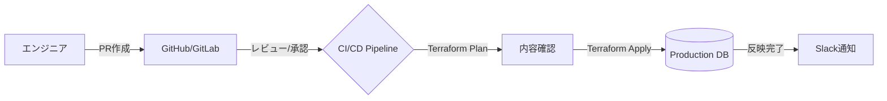

データベースの運用において、もっとも「職人芸（および手動操作）」が残りやすい領域の一つが権限管理（Privilege Management）です。

* 「開発チームに一時的に読み取り権限が欲しいと言われたので、手動でGRANTした」
* 「退職したメンバーのユーザーが、本番DBに残ったままになっている」
* 「どのユーザーがどのテーブルにアクセスできるのか、一覧化されていない」

これらは単なる「運用の手間」ではなく、データベースの信頼性とセキュリティを根底から揺るがす重大なリスクです。

本記事では、著書『実践DBRE Vol.3』の内容に基づき、データベース権限をIaC（Infrastructure as Code）で管理し、ガバナンスとスピードを両立するためのプラクティスを解説します。

## 1. なぜ「手動のGRANT」は悪なのか

従来のDBA的な運用では、必要に応じてSQLで権限を付与してきました。しかし、現代のDBRE（Database Reliability Engineering）の視点では、手動操作は以下の「3つの不確実性」を生みます。

1. **構成のドリフト（乖離）：** Terraform上の定義と実態が異なり、インフラ構成の再現性が失われる。
2. **最小権限の原則（Least Privilege）の形骸化：** 「とりあえず全テーブル参照可能」な権限が乱発され、不要になっても削除されない。
3. **監査の困難さ：** 「いつ、誰が、誰に権限を付与したのか」を追跡するために、DBの監査ログを掘り起こす必要が生じる。

## 2. IaCによる権限管理のアーキテクチャ

DBREは、データベースのユーザーや権限も「インフラのリソース」として定義します。

#### Terraformによるユーザーと権限のコード化
MySQLやPostgreSQLのプロバイダを利用することで、以下のように宣言的な管理が可能になります。

```hcl
# 読み取り専用ロールの定義
resource "mysql_user" "read_only_user" {
  user               = "dev_reader"
  host               = "%"
  plaintext_password = var.db_password
}

resource "mysql_grant" "read_only_access" {
  user       = mysql_user.read_only_user.user
  host       = mysql_user.read_only_user.host
  database   = "app_db"
  privileges = ["SELECT"]
}
```

**権限付与のワークフロー**
権限の追加を「プルリクエスト」ベースで行うことで、以下のような「ガードレール」が機能します。



1. レビュー： 権限付与が適切か、シニアエンジニアやセキュリティ担当がレビュー。
2. 自動適用： マージ後、CI/CDパイプラインからDBへ反映。手動操作を排除。
3. 履歴の資産化： Gitの履歴そのものが、最高精度の監査ログとなる。

## 3. IAMデータベース認証の活用（AWS環境）
さらに一歩進んだプラクティスとして、パスワード認証を廃止し、IAMデータベース認証へ移行することが推奨されます。
* **静的パスワードの排除**： 認証には一時的なトークンを利用するため、パスワードの漏洩リスクがない。
* **権限の統合管理**： AWS IAMポリシーで「DBへの接続可否」を制御できるため、入退社時の権限剥奪を自動化しやすい。

## 結論：セキュリティは「信頼性」の一部である
DBREの定義において、セキュリティは信頼性の重要な構成要素です。「壊れないこと」と同じくらい「不当に操作されないこと」が重要だからです。

権限管理をコードに落とし込み、属人性を排除することで、開発チームに安全かつ迅速にデータを解放できる「攻めのインフラ」を構築しましょう。

## 大規模プロジェクトのリーダー・マネージャーの皆様へ
データベースの「セキュリティ」と「運用の自動化」をどう両立させるか？ その具体的な答えを、私の著書『実践DBRE（Database Reliability Engineering）vol.03』にまとめました。
単なるDBAから、組織の信頼性を支えるDBREへ。技術とプロセス、そしてチームビルディングの全方位からDBの実践についてを整理できる一冊です。
[](https://amzn.asia/d/h4mQ2ge)


