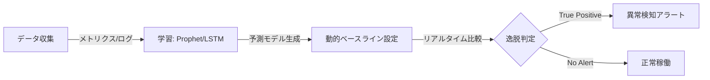

ITシステムの複雑性が増大し、人間の認知限界（Cognitive Gap）を超えつつある現代において、SRE（Site Reliability Engineering）が次に手にするべき武器がAIOpsです。

AIOpsはDevOpsやSREを置き換えるものではなく、膨大なメトリクスやログから意味を抽出するための「知能エンジン」として機能します。本記事では、著書『AIOps実践ガイド』をベースに、運用の現場で使える機械学習モデルの選定基準について解説します。

### 1. 運用のユースケース別：機械学習モデル選択マトリクス

理論的な正しさよりも、実務での「使い勝手」と「精度」を重視したモデル選定が重要です。

| ユースケース | 推奨モデル | 特徴・用途 |
| :--- | :--- | :--- |
| 時系列予測 | Prophet | 季節性や祝日の影響を考慮しやすく、キャパシティプランニングに最適 |
| 異常検知 | Isolation Forest | 高次元データから異常を抽出する能力に優れ、システムの健全性監視に向く |
| ログ分析・RCA | LLM / RAG | 非構造化テキストの文脈を理解し、根本原因分析（RCA）を支援する |

### 2. 「静的閾値」から「動的ベースライン」への転換

従来の「CPU使用率80%でアラート」といった静的閾値（Static Threshold）には2つの大きな欠陥があります。

1. 誤検知（False Positive）： 昼間のアクセス増加など、正常なピークで発報してしまう。
2. 見逃し（False Negative）： 夜間の低負荷時に発生した「本来あり得ない停止」を検知できない。

これを解決するのが、AIによる動的ベースライン（Dynamic Baseline）です。AIが過去のトレンドと季節性を学習し、「今の時間帯、この負荷状況ならこれくらいの値が正常である」という期待値を予測します。

### 3. アラート集約による「アラート疲れ」の解消

1日あたり数千件発生するRawアラートは、エンジニアを疲弊（Alert Fatigue）させます。AIOpsでは以下のステップでノイズを90%以上削減します。

1. 重複排除（Deduplication）： 同一事象によるアラートを1つにまとめる。
2. 相関分析（Correlation）： 時間枠（Time-based）や依存関係（Topology-based）に基づいて、関連するアラートをインシデントに集約する。
3. パターンマッチング： テキストの類似度をクラスタリングし、過去の既知の問題と紐づける。

### 結論：Observe-Engage-Act のサイクルを回す

自律型運用（Autonomous Operations）への道は、まず「Observe（観測）」によってデータを統合することから始まります。そこに機械学習を用いた「Engage（分析）」を加え、最終的に「Act（自動化）」へと繋げることで、運用を「守り」から「攻め」へと変えることができます。

技術を盲信せず、SHAPやLIMEなどの手法で「AIの判断根拠」を可視化（Explainable AI）しながら、チームの信頼を築いていきましょう。

## IT運用を「ビジネスの加速装置」へ

私の著書『AIOps実践ガイド：自律型IT運用への進化論』では、本記事で紹介した各モデルの選定基準や、継続的な改善を支えるMLOps（機械学習の運用）パイプラインの構築、さらには組織の成熟度を上げるためのロードマップを詳述しています。詳しく知りたい方は、ぜひ『AIOps実践ガイド：自律型IT運用への進化論』を手に取ってみてください。
